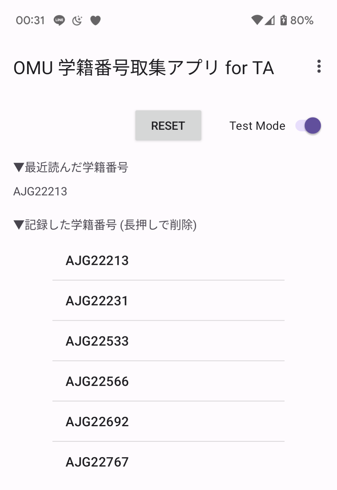

# OMU Card Collector

Card Collector Application for Teaching Assistant at Osaka Metropolitan University
基本的に TA さんのためのアプリになりそう

## 使い方

1. アプリをインストール
2. 大阪公立大学(府立大学)の学生証を読み込む
3. 番号順に並び替えしてリスト形式で表示されます。
4. 長押しで項目削除、RESET で全削除。TestMode は読んだカードの下三桁をランダムな数字にするモード

## 作った経緯

手を挙げた人全員が点数をもらえる授業があり、数えるのが面倒なのかなぜか僕に履修者名簿渡して全員分チェックさせられる。しかも A5 棟のそこそこの教室なので回るのが大変なので作りました。

## スクリーンショットとか！

